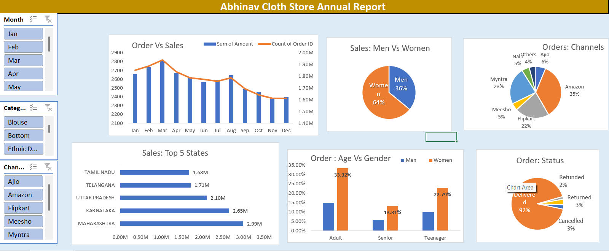

# Abhinav Cloth Store – Annual Sales Dashboard (Excel)

## 📌 Project Overview
This project is an interactive Excel dashboard built to analyze the annual sales performance of Abhinav Cloth Store.  
The objective is to convert raw sales data into meaningful business insights for decision-making.

## 🔍 Key Insights Covered
- Monthly **Orders vs Sales** trend analysis  
- **Gender-wise** sales distribution (Men vs Women)  
- **Sales channel performance** (Amazon, Flipkart, Myntra, Ajio, Meesho, etc.)  
- **Top 5 performing states** by revenue  
- **Age group vs Gender** ordering behavior  
- **Order status analysis** (Delivered, Cancelled, Returned, Refunded)

## 🛠 Tools Used
- Microsoft Excel  
- Pivot Tables  
- Pivot Charts  
- Slicers & Filters  
- Dashboard Design Principles

## 🎯 Business Value
- Identifies high-performing sales channels and regions  
- Helps understand customer demographics and buying behavior  
- Supports management decisions using data-backed visuals  

## 📷 Dashboard Preview

📌 *This project is part of my learning journey in Data Analytics and Business Intelligence.*
